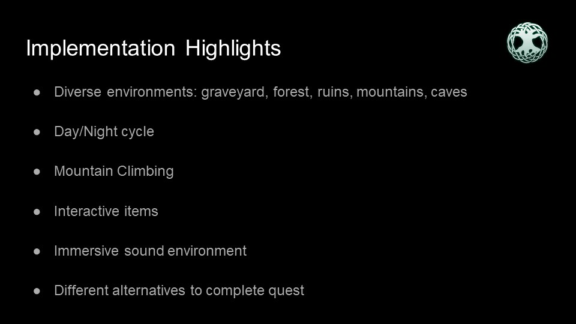
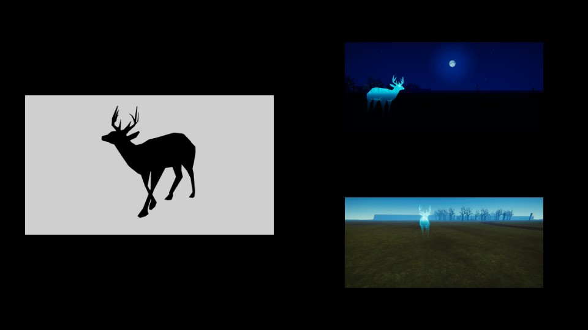

# Aurora's Heart
Exploration VR game for HTC Vive made with Unity

# Premise

You, Freya, are a young girl born to mystical powers. One day, you wake up next to a lone 
mysterious wolf and into a world crumbling to pieces for reasons unknown. No one at your
village seems to have any recollection of you or your parents, apart from the strange wolf. You
set on a quest to find your parents and the reasons behind this strange events, only
accompanied by Hugrel, the wolf. You must decide your interactions with Hugrel, and if you
want his help you must gain his trust. Or you can simply rely on your powers to quickly solve the
problems you encounter, but beware of the consequences.

# Overview
Check some videos [here](https://www.youtube.com/playlist?list=PL0ESwRe-UpiLHowOu0vHDyskvulGUTKnE).

